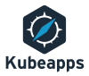

<h1 align="center">Kubeapps Bitnami Helm Chart</h1>

### Overview

Kubeapps is a web application designed for deploying and managing applications in Kubernetes clusters. Unlike the Kubernetes dashboard, Kubeapps provides a central
location for your applications and their full life-cycle. Using it, your cluster users can deploy applications packaged as Helm charts directly from their browsers.

### Features of Bitnami Kubeapps Helm Chart

- Browse and deploy Helm charts from chart repositories
- Inspect, upgrade and delete Helm-based applications installed in the cluster
- Add custom and private chart repositories (supports ChartMuseum and JFrog Artifactory)
- Browse and deploy Kubernetes Operators.
- Secure authentication to Kubeapps using an OAuth2/OIDC provider
- Secure authorization based on Kubernetes Role-Based Access Control

Kubeapps can be used with the following Kubernetes services:
-  Azure Kubernetes Service (AKS)
-  Google Kubernetes Engine (GKE)
-  Oracle Container Engine for Kubernetes (OKE)
-  Minikube
-  Docker for Desktop Kubernetes

### Objective of tutorial

In this tutorial,we are going to cover following topics:

- Install Kubeapps Bitnami Helm Chart and verify its successful installation.
- Verify the status of pods and services. 
- Describe configurable parameters of the Kubeapps Bitnami Helm Chart and their default values.
- Access Kubeapps dashboard and deploy applications in the cluster through Helm Charts.
- Upgrade the Kubeapps.
- Uninstall Kubeapps Helm Chart and release the resources.

